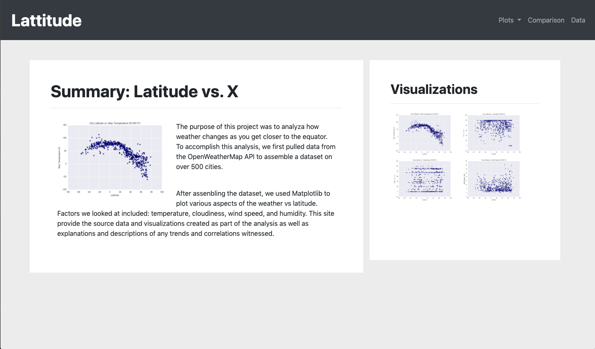

# Web-Design-Challenge

### **Overview**
#### For this project I created a visualization dashboard website using visualizations have created in a past project ([python-api-challenge](https://github.com/YANG007SUN/python-api-challenge)).

### **Structure of the page**
For reference, see the ["Screenshots" section](#screenshots) below.

The website consists of 7 pages total, including:

* A [landing page](#landing-page) containing:
  * An explanation of the project.
  * Links to each visualizations page.

* Four [visualization pages](#visualization-pages), each with:
  * A descriptive title and heading tag.
  * The plot/visualization itself for the selected comparison.
  * A paragraph describing the plot and its significance.

* A ["Comparisons" page](#comparisons-page) that:
  * Contains all of the visualizations on the same page so we can easily visually compare them.

* A ["Data" page](#data-page) that:
  * Displays a responsive table containing the data used in the visualizations.

### Screenshots

#### Landing page

#### Comparisons page

#### Visualization pages

#### Data page

